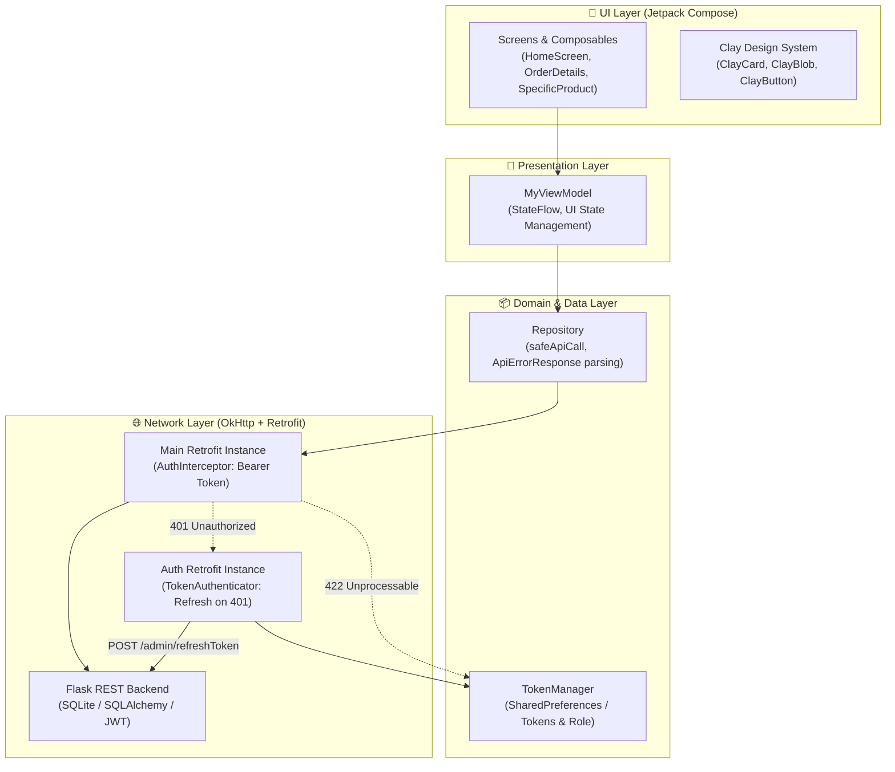
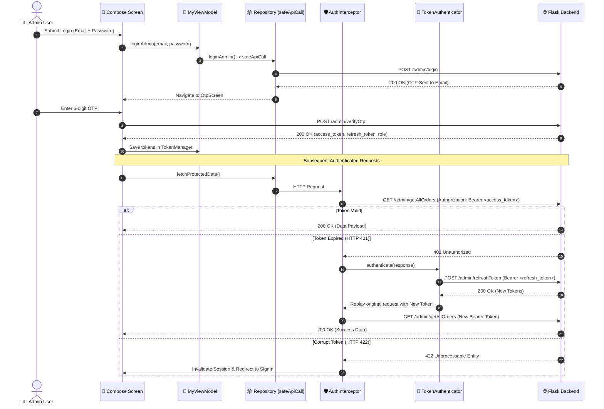
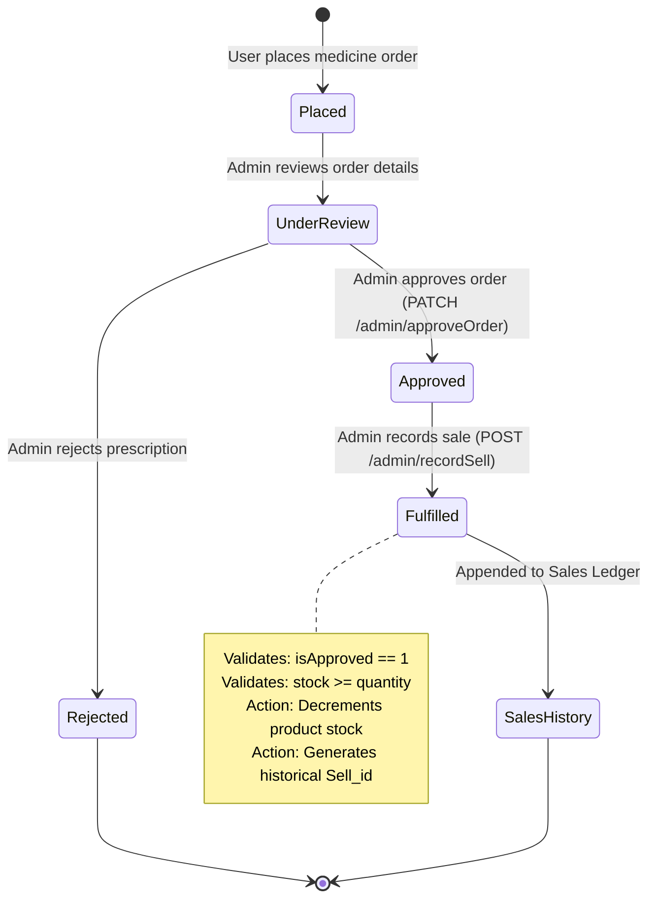

# 🏥 MediAdminApp — Healthcare & Pharmacy Admin Dashboard

<p align="center">
  
  
  
  
  
</p>

<p align="center">
  <a href="https://github.com/It-Saurabh001/Admin_Medi_App/stargazers"></a>
  <a href="https://github.com/It-Saurabh001/Admin_Medi_App/network/members"></a>
  <a href="https://github.com/It-Saurabh001/Admin_Medi_App/issues"></a>
  <a href="https://github.com/It-Saurabh001/Admin_Medi_App/blob/master/LICENSE"></a>
  <a href="https://github.com/It-Saurabh001/Admin_Medi_App/pulls"></a>
</p>

---

> **A mission-critical, enterprise-grade Android administrative suite for healthcare and pharmaceutical operations.**  
> Built with **Jetpack Compose (Material 3)**, **Tactile Claymorphism**, **Dagger Hilt**, and a hardened **Retrofit 2 / OkHttp** networking pipeline with silent JWT token rotation and 404/422 crash-resilient data handling.

---

## 📑 Table of Contents

- [📌 About The Project](#-about-the-project)
- [✨ Key Features](#-key-features)
- [🏗️ Architecture & Workflow](#️-architecture--workflow)
  - [System Architecture](#system-architecture)
  - [JWT Authentication & Silent Refresh Pipeline](#jwt-authentication--silent-refresh-pipeline)
  - [Order Fulfillment Lifecycle](#order-fulfillment-lifecycle)
- [🎨 Design System — Claymorphism](#-design-system--claymorphism)
- [🛠️ Tech Stack & Dependencies](#️-tech-stack--dependencies)
- [📁 Project Directory Structure](#-project-directory-structure)
- [🚀 Getting Started & Local Setup](#-getting-started--local-setup)
  - [Prerequisites](#prerequisites)
  - [Environment Setup (`secrets.properties`)](#environment-setup-secretsproperties)
  - [Build and Run](#build-and-run)
- [🔌 API Endpoints Reference](#-api-endpoints-reference)
- [🧪 Testing & Verification](#-testing--verification)
- [🤝 Contributing](#-contributing)
- [📄 License](#-license)

---

## 📌 About The Project

Operating a modern medical pharmacy or healthcare distribution network requires real-time precision: tracking pharmaceutical inventory, managing doctor/patient accounts, validating prescription orders, and auditing historical sales revenue.

**MediAdminApp** solves the friction of pharmaceutical administration by providing a high-performance Android tablet/phone client backed by a Flask REST API. The app is engineered for zero downtime and resilient data synchronization:

* **Eliminates Crashes on Missing Records:** Implements strictly verified nullable JSON serialization models for 404/empty responses.
* **Seamless Authentication Recovery:** Dual-client Retrofit setup featuring an isolated auth client that refreshes expired access tokens behind the scenes without interrupting admin workflows.
* **Corrupt Session Eviction:** Intercepts unprocessable JWT tokens (HTTP 422) and automatically purges saved sessions, gracefully routing users back to secure authentication.
* **Zero Token & PII Leaks:** Dynamic HTTP logging levels bound to `BuildConfig.DEBUG` ensuring production release builds remain silent and compliant.

---

## ✨ Key Features

- 🔐 **Dual-Stage Admin Authentication:** Secure email/password login integrated with backend SMTP 6-digit OTP verification and automatic session persistence.
- 🔄 **Silent Token Rotation:** OkHttp `TokenAuthenticator` intercepts HTTP 401, issues a synchronous token rotation call via `/admin/refreshToken`, persists updated tokens, and replays failed requests seamlessly.
- 🛡️ **Session Invalidation:** Automatic interception of HTTP 422 (corrupt JWT or changed server secret) evicts credentials and routes to sign-in.
- 👥 **User & Role Management:** List, filter, approve, block, update, or permanently delete customer and staff accounts with live status indicators.
- 📦 **Pharmaceutical Inventory Management:** Real-time stock counts, category filtering, search, pricing updates, and multipart image uploads with integrated cropping (`uCrop`).
- 📋 **Order Dispatch Lifecycle:** Step-by-step review of patient orders, prescription verification, order notes, price adjustments, and approval toggling.
- 💰 **Stock-Deducting Sale Fulfillment:** Direct integration with `/admin/recordSell` ensuring orders cannot be fulfilled unless approved and sufficient inventory is available.
- 📊 **Audited Sales History:** Chronological ledger of all historical sales, filterable by individual user or product ID, with transactional deletion support.
- 🎨 **Tactile Claymorphic UI:** Custom elevated design system with inner highlights, soft diffuse shadows, floating action bars, and interactive animations.

---

## 🏗️ Architecture & Workflow

### System Architecture

The application strictly adheres to the **Clean MVVM (Model-View-ViewModel)** architectural pattern with Unidirectional Data Flow (UDF) powered by Kotlin Coroutines and `StateFlow`:



---

### JWT Authentication & Silent Refresh Pipeline



---

### Order Fulfillment Lifecycle



---

## 🎨 Design System — Claymorphism

MediAdminApp features a bespoke **Claymorphic Visual Architecture** engineered in Jetpack Compose to give administrators a tactile, playful, yet ultra-clean dashboard experience:

* **Dual Soft Shadowing:** Combines soft, diffuse dark elevation shadows with crisp white inner specular highlights to evoke physical polymer clay tiles.
* **Visual Hierarchy:** Distinct themed gradients for orders (`ClayOrderGradient`), products (`ClayProductGradient`), and sales analytics (`ClayHistoryGradient`).
* **Tactile Interactions:** Custom interactive clay components (`ClayCard`, `ClayPrimaryButton`, `ClayOutlinedButton`, `ClayDangerButton`).
* **Stateful Feedbacks:** Integrated `ClayLoadingScreen`, `ClayEmptyState`, and `ClayErrorScreen` with retry triggers and shake animations on validation failure.

---

## 🛠️ Tech Stack & Dependencies

| Category | Technology / Library | Version | Description |
| :--- | :--- | :--- | :--- |
| **Language** | [Kotlin](https://kotlinlang.org/) | `2.4.0` | Modern, expressive, and type-safe language |
| **Android Framework** | [Android SDK / AGP](https://developer.android.com/) | `compileSdk 37 / AGP 9.1.1` | Target SDK 35 (Android 15 ready), Min SDK 31 |
| **UI Framework** | [Jetpack Compose BOM](https://developer.android.com/jetpack/compose) | `2026.09.00` | Declarative reactive UI toolkit |
| **Design System** | [Material 3](https://m3.material.io/) + Claymorphism | Embedded | Custom tactile clay components & dynamic themes |
| **Dependency Injection** | [Dagger Hilt](https://dagger.dev/hilt/) | `2.60.1` | Scalable dependency injection with KSP |
| **Networking** | [Retrofit 2](https://square.github.io/retrofit/) | `3.0.0` | Type-safe REST client for Android and Java |
| **HTTP Engine** | [OkHttp](https://square.github.io/okhttp/) | `5.5.0` | Resilient HTTP/2 connection pooling & interceptors |
| **Serialization** | [Gson Converter](https://github.com/google/gson) | `3.0.0` | JSON serialization with `safeApiCall` error parsing |
| **Image Processing** | [uCrop](https://github.com/Yalantis/uCrop) | `2.2.8` | Precise product image cropping and aspect ratio tuning |
| **Security** | [Security Crypto](https://developer.android.com/jetpack/androidx/releases/security) | `1.1.0` | Secure credential and token persistence |
| **Testing** | [JUnit 4](https://junit.org/junit4/) / [Espresso](https://developer.android.com/training/testing/espresso) | `4.13.2 / 3.7.0` | Unit and automated UI interaction tests |

---

## 📁 Project Directory Structure

```text
MediAdminApp/
├── app/
│   ├── src/
│   │   ├── main/
│   │   │   ├── java/com/saurabh/mediadminapp/
│   │   │   │   ├── common/                  # Unified ResultState (Loading, Success, Error)
│   │   │   │   ├── network/                 # Networking & API integration
│   │   │   │   │   ├── response/            # Strictly typed, null-safe API response models
│   │   │   │   │   ├── ApiProvider.kt       # Hilt DI provider for Main/Auth Retrofit & OkHttp
│   │   │   │   │   ├── ApiServices.kt       # Retrofit HTTP interface definitions (30+ endpoints)
│   │   │   │   │   ├── AuthInterceptor.kt   # Authorization header injection & HTTP 422 eviction
│   │   │   │   │   ├── TokenAuthenticator.kt# HTTP 401 silent token refresh handler
│   │   │   │   │   └── TokenManager.kt      # Encrypted storage for JWTs and admin role
│   │   │   │   ├── repository/              # Repository layer with safeApiCall & error deserializer
│   │   │   │   │   └── Repository.kt        # Single source of truth for all business API calls
│   │   │   │   ├── ui/
│   │   │   │   │   ├── screens/             # Jetpack Compose Screens
│   │   │   │   │   │   ├── components/      # Claymorphic UI primitives (Cards, Buttons, Badges)
│   │   │   │   │   │   ├── nav/             # Navigation graphs, route arguments, and bottom bars
│   │   │   │   │   │   ├── HomeScreen.kt    # Admin dashboard overview and analytics
│   │   │   │   │   │   ├── OrderDetailsScreen.kt # Orders list and dispatch status
│   │   │   │   │   │   ├── SpecificOrderScreen.kt# Single order detail, receipt view & approval
│   │   │   │   │   │   ├── SpecificProductScreen.kt # Product detail, stock counter & actions
│   │   │   │   │   │   ├── UpdateProductScreen.kt   # Product edit form with image crop
│   │   │   │   │   │   ├── UserDetailsScreen.kt     # Customer profile, permissions & status
│   │   │   │   │   │   ├── HistroyScreen.kt         # Audited sales history ledger
│   │   │   │   │   │   ├── SignIn.kt                # Admin credential authentication
│   │   │   │   │   │   └── OtpScreen.kt             # 6-digit email OTP verification screen
│   │   │   │   │   └── theme/               # Colors, Typography, Shapes, and Clay tokens
│   │   │   │   ├── utils/                   # Extension functions, multipart helpers, and constants
│   │   │   │   ├── BaseApplication.kt       # Hilt Application entry point
│   │   │   │   └── MyViewModel.kt           # Central StateFlow ViewModel orchestrator
│   │   │   ├── res/                         # Vector drawables, mipmaps, and XML configs
│   │   │   └── AndroidManifest.xml          # App permissions and activity declarations
│   │   └── test/                            # Unit tests for repositories and view models
│   ├── build.gradle.kts                     # App module configuration and buildFeatures
│   └── proguard-rules.pro                   # ProGuard / R8 code shrinking rules
├── gradle/
│   └── libs.versions.toml                   # Centralized Version Catalog
├── build.gradle.kts                         # Root project build configuration
├── settings.gradle.kts                      # Repository configurations
└── README.md                                # Project documentation
```

---

## 🚀 Getting Started & Local Setup

### Prerequisites

Ensure your development environment meets the following minimum requirements:

* **Android Studio:** Ladybug (2024.2.1+) or newer
* **Java Development Kit (JDK):** Version 17
* **Android SDK:** Platform 35+ installed with Android Build-Tools
* **Backend API:** Running instance of the Medical Management Flask REST backend (default: `http://10.0.2.2:5000/` for Android Emulator or your local LAN IP for physical devices).

---

### Environment Setup (`secrets.properties`)

Create a `secrets.properties` file in the root directory of the project (this file is ignored by git to protect credentials):

```properties
# Base URL for Android Emulator
WirelessPhysicalDevice=http://10.0.2.2:5000/

# For physical device testing over Wi-Fi, use your local machine's IP address:
# WirelessPhysicalDevice=http://192.168.1.100:5000/
```

> [!TIP]
> The app reads `WirelessPhysicalDevice` at build time and injects it into `BuildConfig.WirelessPhysicalDevice`. You can switch between emulator and physical device endpoints without touching Kotlin code.

---

### Build and Run

1. **Clone the repository:**
   ```bash
   git clone https://github.com/It-Saurabh001/Admin_Medi_App.git
   cd Admin_Medi_App
   ```

2. **Open with Android Studio:**
   - Select **File > Open** and point to the `Admin_Medi_App` directory.
   - Wait for Gradle sync to complete and download all dependencies from the version catalog.

3. **Compile and execute Debug build:**
   ```powershell
   .\gradlew.bat assembleDebug
   ```

4. **Run Unit Tests:**
   ```powershell
   .\gradlew.bat testDebugUnitTest
   ```

---

## 🔌 API Endpoints Reference

<details>
<summary><b>Click to expand full API specification table (30+ Endpoints)</b></summary>

| HTTP Method | Endpoint | Description | Auth Required |
| :--- | :--- | :--- | :---: |
| `POST` | `/admin/login` | Authenticate admin credentials and dispatch email OTP | ❌ No |
| `POST` | `/admin/verifyOtp` | Verify 6-digit OTP and receive JWT access/refresh tokens | ❌ No |
| `POST` | `/admin/refreshToken` | Exchange refresh token for fresh access/refresh token pair | 🔑 Bearer (Refresh) |
| `POST` | `/admin/requestAdminPasswordReset` | Request password reset OTP for registered admin email | ❌ No |
| `POST` | `/admin/resetAdminPasswordWithOtp` | Complete password reset using OTP, user ID, and new password | ❌ No |
| `POST` | `/admin/create` | Register a new administrator account | 🔒 Bearer (Admin) |
| `GET` | `/admin/getAllAdmins` | Retrieve all registered administrator accounts | 🔒 Bearer (Admin) |
| `PATCH` | `/admin/update` | Update administrator profile details (name, email, phone) | 🔒 Bearer (Admin) |
| `POST` | `/admin/delete` | Remove an administrator account | 🔒 Bearer (Admin) |
| `GET` | `/admin/getAllUsers` | Fetch all registered customers/patients | 🔒 Bearer (Admin) |
| `POST` | `/admin/user/getSpecificUser` | Retrieve detailed profile for specific user ID | 🔒 Bearer (Admin) |
| `PATCH` | `/admin/approveUser` | Toggle user verification / approval state | 🔒 Bearer (Admin) |
| `PATCH` | `/admin/updateUser` | Update customer account attributes | 🔒 Bearer (Admin) |
| `POST` | `/admin/deleteUser` | Delete a customer account permanently | 🔒 Bearer (Admin) |
| `GET` | `/admin/user/getAllProducts` | Fetch complete inventory catalog of medical products | 🔒 Bearer (Admin) |
| `POST` | `/admin/user/getSpecificProduct` | Fetch specifications and stock count for a single product | 🔒 Bearer (Admin) |
| `POST` | `/admin/addProduct` | Add new medicine/product with multipart image upload | 🔒 Bearer (Admin) |
| `PATCH` | `/admin/updateProduct` | Update product details, stock count, and optional image | 🔒 Bearer (Admin) |
| `POST` | `/admin/deleteProduct` | Remove product permanently from inventory | 🔒 Bearer (Admin) |
| `GET` | `/admin/getAllOrders` | Retrieve all submitted patient medication orders | 🔒 Bearer (Admin) |
| `POST` | `/admin/user/getOrdersByUserId` | Fetch order history associated with a specific customer | 🔒 Bearer (Admin) |
| `POST` | `/admin/user/orderById` | Fetch granular order receipt by order ID | 🔒 Bearer (Admin) |
| `PATCH` | `/admin/updateOrder` | Adjust order quantity, price, or prescription notes | 🔒 Bearer (Admin) |
| `PATCH` | `/admin/approveOrder` | Approve or reject order before fulfillment | 🔒 Bearer (Admin) |
| `POST` | `/admin/deleteOrder` | Delete an order record | 🔒 Bearer (Admin) |
| `POST` | `/admin/recordSell` | Fulfill approved order, decrement stock, and record sale | 🔒 Bearer (Admin) |
| `GET` | `/admin/getSellHistory` | Retrieve audited chronological ledger of all sales | 🔒 Bearer (Admin) |
| `POST` | `/admin/user/getSellHistoryByUserId`| Filter sales transaction records by customer | 🔒 Bearer (Admin) |
| `POST` | `/admin/getproductsellhistory` | Filter sales transaction records by specific product ID | 🔒 Bearer (Admin) |
| `POST` | `/admin/deleteSellHistory` | Remove a historical sales transaction record | 🔒 Bearer (Admin) |

</details>

---

## 🧪 Testing & Verification

The project includes unit tests for verifying ViewModel states and network repository responses:

```bash
# Run local unit tests
./gradlew testDebugUnitTest

# Run connected Android instrumented tests on an emulator/device
./gradlew connectedAndroidTest
```

> [!NOTE]  
> All API calls are routed through the centralized `safeApiCall` helper in `Repository.kt`. It encapsulates error body parsing via `ApiErrorResponse` and prevents unhandled HTTP exceptions or UI state freezes.

---

## 🤝 Contributing

Contributions make the open-source community an inspiring place to learn, inspire, and create. Any contributions you make are **greatly appreciated**.

1. **Fork the Project**
2. **Create your Feature Branch:**
   ```bash
   git checkout -b feature/AmazingFeature
   ```
3. **Commit your Changes:**
   ```bash
   git commit -m 'Add some AmazingFeature'
   ```
4. **Push to the Branch:**
   ```bash
   git push origin feature/AmazingFeature
   ```
5. **Open a Pull Request**

---

## 📄 License

Distributed under the **MIT License**. See [`LICENSE`](LICENSE) for more information.

---

<p align="center">
  Developed with ❤️ by <a href="https://github.com/It-Saurabh001"><b>Saurabh</b></a>
</p>
